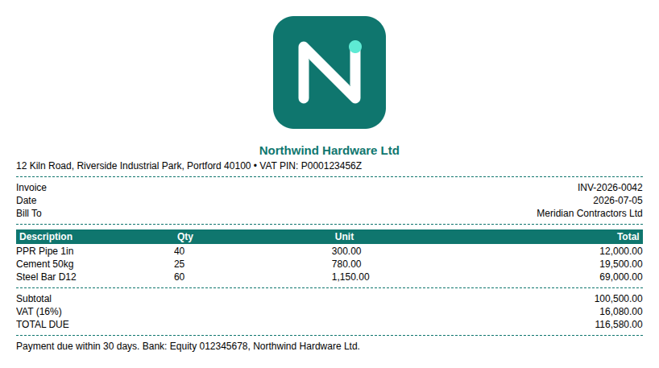
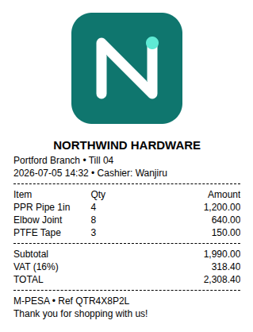
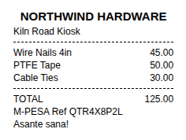
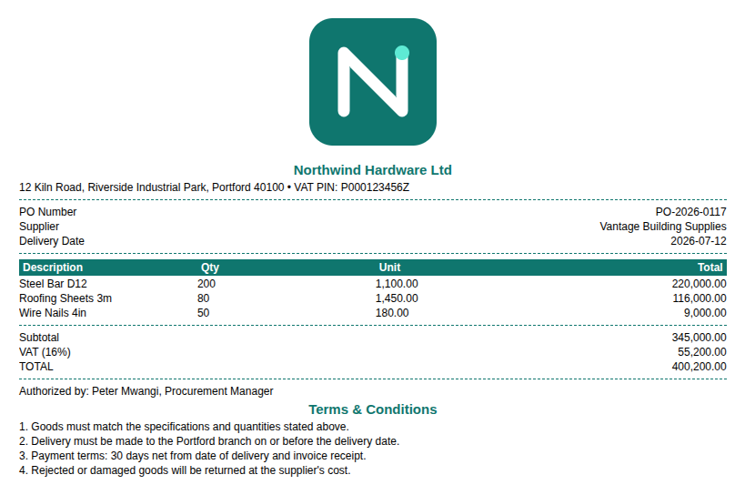
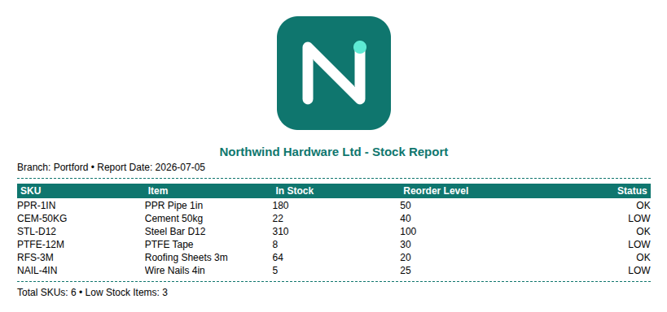

# spooler

Unified Kotlin Multiplatform document generation and printing. Build thermal receipts
(80mm / 58mm ESC/POS) and page-bound business documents (A4 invoices, purchase orders,
reports) from a single common-code API, then send them to the OS print spooler, a thermal
printer, or save them to a file. Runs on Android, iOS, Desktop (JVM), and Web (Wasm/JS).

<p align="center">
  
  &nbsp;
  
  &nbsp;
  
</p>

## Why spooler

- **One API, every layout.** The same fluent builder produces continuous thermal receipts
  and page-bound A4 documents; `DocumentType` decides the page geometry.
- **Common-code layout.** Documents are built as HTML5 + CSS3 strings in `commonMain` using
  flexbox rows, so a single definition renders identically across platforms.
- **Fully offline.** Logos and images are embedded as Base64 data URIs — no native asset
  paths, no network, no file plumbing.
- **Colors and logos.** Business documents support a brand accent color and colored header
  rows; receipts stay monochrome for thermal hardware.
- **Bring your own HTML.** Already have document markup? Print it directly, or drop it into
  a builder with `addRawHtml`.
- **Native output per platform.** WebView + `PrintManager` (Android),
  `UIPrintInteractionController` (iOS), OpenHtmlToPdf + `javax.print` (Desktop), and an
  `iframe` + `Blob` pipeline (Web), plus a raw ESC/POS command path on Desktop.

## Install

```kotlin
// settings.gradle.kts -> dependencyResolutionManagement { repositories { mavenCentral() } }

// build.gradle.kts (commonMain)
implementation("io.github.ellykits:spooler:1.0.0-alpha02")
```

## Quickstart

The document below is the invoice shown in the screenshot above:

```kotlin
val invoice =
  UnifiedDocument(DocumentType.A4_DOCUMENT, title = "Tax Invoice", accentColor = "#0F766E")
    .addLogo(logoBytes, ImageType.PNG)
    .addHeader("Northwind Hardware Ltd")
    .addText("12 Kiln Road, Riverside Industrial Park, Portford 40100 • VAT PIN: P000123456Z")
    .addDivider()
    .addTableRow("Invoice", "INV-2026-0042")
    .addTableRow("Bill To", "Meridian Contractors Ltd")
    .addDivider()
    .addHeaderRow("Description", "Qty", "Unit", "Total")
    .addTableRow("PPR Pipe 1in", "40", "300.00", "12,000.00")
    .addTableRow("Cement 50kg", "25", "780.00", "19,500.00")
    .addDivider()
    .addTableRow("TOTAL DUE", "", "", "116,580.00")
    .addText("Payment due within 30 days.")

val result = engine.print(invoice, PrintTarget.SaveToFile("invoice.pdf"))
if (result.isSuccess) println("Done: $result")
```

`print(document, target)` is the primary entry point — it builds the HTML and forwards the
document's `DocumentType` for you. `engine` is a `PrintEngine`; see
[Constructing the engine](#constructing-the-engine-per-platform).

A thermal receipt is the same builder with a continuous `DocumentType`:

```kotlin
val receipt =
  UnifiedDocument(DocumentType.RECEIPT_80MM, title = "Receipt")
    .addLogo(logoBytes, ImageType.PNG)
    .addHeader("NORTHWIND HARDWARE")
    .addTableRow("PPR Pipe 1in", "4", "1,200.00")
    .addDivider()
    .addTableRow("TOTAL", "", "2,308.40")

engine.print(receipt, PrintTarget.SendToPrinter(EscPosDriver(paperWidthMm = 80)))
```

## Sample documents

The `:demo` module builds three business documents and two receipts for a fictitious
hardware business. Rendered output:

| Invoice | Purchase order | Stock report | Sale receipt | Compact receipt |
| --- | --- | --- | --- | --- |
|  |  |  |  |  |

## API

| Type | Purpose |
| --- | --- |
| `UnifiedDocument(type, title, accentColor?)` | Fluent builder: `addLogo`, `addImage`, `addHeader`, `addText`, `addTableRow`, `addHeaderRow`, `addDivider`, `addNewPage`, `addRawHtml`, `buildHtml` |
| `DocumentType` | `RECEIPT_80MM`, `RECEIPT_58MM`, `A4_DOCUMENT` |
| `ImageType` | `PNG`, `JPEG`, `SVG` |
| `PrinterDriver` | `EscPosDriver(paperWidthMm, charactersPerLine, cut, openDrawer, printerName)`, `StandardSystemDriver(printerName, copies)`, `NetworkEscPosDriver(host, port, charactersPerLine, cut, openDrawer)` |
| `PrintTarget` | `SaveToFile(path)`, `SendToPrinter(driver)` |
| `PrintResult` | `Success`, `Saved(path)`, `Failure(message, cause)` — with `result.isSuccess` |
| `PrintEngine` | `suspend print(document, target)` (preferred), `suspend execute(html, target, type)`, `registerFont(font)` |
| `RegisteredFont(name, bytes, weight?, style?)` | A font file to make available to the renderer |
| `FontStyle` | `NORMAL`, `ITALIC`, `OBLIQUE` |
| `Base64` | `encode(bytes)` |

## Images and colors

Embed a centered logo or a full-width inline image — both are Base64-encoded into the
document, so nothing is loaded from disk or network at print time:

```kotlin
document.addLogo(logoBytes, ImageType.PNG)   // centered brand mark
document.addImage(photoBytes, ImageType.JPEG) // full-width inline image
```

Give page-bound documents a brand accent color and colored table headers (receipts stay
monochrome for thermal printers, so leave `accentColor` unset for them):

```kotlin
UnifiedDocument(DocumentType.A4_DOCUMENT, accentColor = "#0F766E")
  .addHeaderRow("Description", "Qty", "Total") // rendered in the accent color
  .addTableRow("PPR Pipe 1in", "40", "12,000.00")
```

## Bring your own HTML

Already have document markup? Print a complete HTML document directly:

```kotlin
engine.execute(myExistingHtml, PrintTarget.SaveToFile("report.pdf"), DocumentType.A4_DOCUMENT)
```

…or fold an existing HTML fragment into a spooler document (inserted verbatim):

```kotlin
UnifiedDocument(DocumentType.A4_DOCUMENT)
  .addHeader("Summary")
  .addRawHtml("<table class=\"legacy\">…your markup…</table>")
```

## Constructing the engine per platform

`PrintEngine` is an `expect class`; its constructor differs only because Android needs a
`Context` to drive `WebView`/`PrintManager`:

- Android: `PrintEngine(context)`
- iOS / Desktop / Web: `PrintEngine()`

A common pattern is a small `expect fun` factory in your app (the `:demo` module's
`EngineFactory` shows this) so shared code has one entry point.

## Printer transport support

| Transport | Driver | Android | iOS | Desktop | Web |
|---|---|:---:|:---:|:---:|:---:|
| Network thermal, raw TCP 9100 | `NetworkEscPosDriver` | ✅ | ✅ | ✅ | ❌ |
| USB / serial thermal, via the OS print queue | `EscPosDriver` | ❌ | ❌ | ✅ | ❌ |
| USB thermal, driven directly | — | ❌ | ❌ | ❌ | ❌ |
| Bluetooth Classic (SPP) thermal | — | ❌ | ❌ | ❌ | ❌ |
| Bluetooth LE thermal | — | ❌ | ❌ | ❌ | ❌ |
| System print dialog (PDF) | `StandardSystemDriver` | ✅ | ✅ | ✅ | ✅ |

| Capability | Android | iOS | Desktop | Web |
|---|:---:|:---:|:---:|:---:|
| `render` → PDF bytes | ✅ | ✅ | ✅ | ❌ |
| `SaveToFile` writes a PDF | ✅ | ✅ | ✅ | ❌ |
| `registerFont` embeds a custom typeface | ❌ (no-op) | ❌ (no-op) | ✅ | ❌ (no-op) |

`NetworkEscPosDriver` is the supported route for thermal printing on Android, iOS and Desktop.
USB reaches a Desktop printer through the OS print queue. Bluetooth is not supported: Classic
SPP requires MFi certification on iOS, and the browser can open neither a raw socket nor a
Classic Bluetooth connection.

On Android and iOS a local `EscPosDriver` renders the HTML through the system print dialog
rather than emitting ESC/POS. Raw bytes are produced locally on Desktop only.

## Platform behavior notes

- **Android `SaveToFile`** now renders to bytes and writes them directly, the same as
  Desktop and iOS. Previously both `PrintTarget` variants routed to `PrintManager`, so
  `SaveToFile` opened the same dialog as `SendToPrinter` and wrote nothing — the path
  argument only became the print job's name.
- **`render(html, type)`** returns PDF bytes (`PrintResult.Rendered`) on Android, iOS, and
  Desktop. The browser has no PDF renderer, so `render` there always fails with
  `PrintResult.Failure`.
- **Web `SaveToFile`** downloads an `.html` file (the browser has no PDF renderer); the
  requested path's extension is coerced to `.html`.
- **iOS `SendToPrinter`** uses `UIPrintInteractionController`. On iPhone it presents
  animated; on iPad it presents from the key window's root view. Apps built on the modern
  multi-scene lifecycle may need to supply their own presentation anchor.
- **`NetworkEscPosDriver`** sends raw ESC/POS bytes to a thermal printer over TCP port 9100,
  the conventional raw-print port for network receipt printers. It works on Android, iOS,
  and Desktop; the browser rejects it outright, since it can't open a raw socket. Bluetooth
  Classic (SPP) printers are deliberately not supported — pairing is native-only on
  Android, and iOS printing over SPP needs MFi certification spooler doesn't have.
- **`registerFont`** is a no-op on Android, iOS, and Web — they render through platform
  engines (`WebView`, `UIMarkupTextPrintFormatter`, the browser) that resolve fonts by name
  from the OS or page and can't accept font bytes through this call. spooler bundles no
  font of its own, so desktop PDFs fall back to PDFBox's built-in base-14 fonts (Latin-1
  only) unless a consumer registers one. Registering a font on the Desktop `PrintEngine`
  loads it into the PDF renderer and overrides the generated CSS's font-family stack —
  ahead of the default `-apple-system, "Segoe UI", Roboto, sans-serif` — for every
  subsequent `execute`/`render` call on that engine; register nothing and output is
  unchanged.
- **ESC/POS text** is emitted as ASCII; non-ASCII characters are replaced with `?`.
  `EscPosDriver.charactersPerLine` defaults to `null`, deriving 32 or 48 columns from
  `paperWidthMm`; an explicit value (including `0`, meaning never wrap) overrides it.
  `EscPosDriver.printerName` targets a specific print service instead of the OS default.
  Thermal printing on Desktop, and `NetworkEscPosDriver` on every non-web platform, use
  this raw path; Android and iOS still render the HTML for a local `EscPosDriver` on
  `SendToPrinter`.

## Demo

The `:demo` module is a Compose Multiplatform app that generates the five sample documents
above and prints or saves them with `spooler`.

- Desktop: `./gradlew :demo:run`
- Web: `./gradlew :demo:wasmJsBrowserDevelopmentRun`
- Android / iOS: open the project in an IDE and run the `demo` app target.

## Publishing

`:spooler` uses the [vanniktech maven-publish
plugin](https://github.com/vanniktech/gradle-maven-publish-plugin) to publish to Maven
Central via the Central Portal. Releasing requires a GPG signing key and Central Portal
credentials configured locally or in CI:

```bash
./gradlew publishAndReleaseToMavenCentral
```

## License

Apache 2.0. See [LICENSE](LICENSE).
